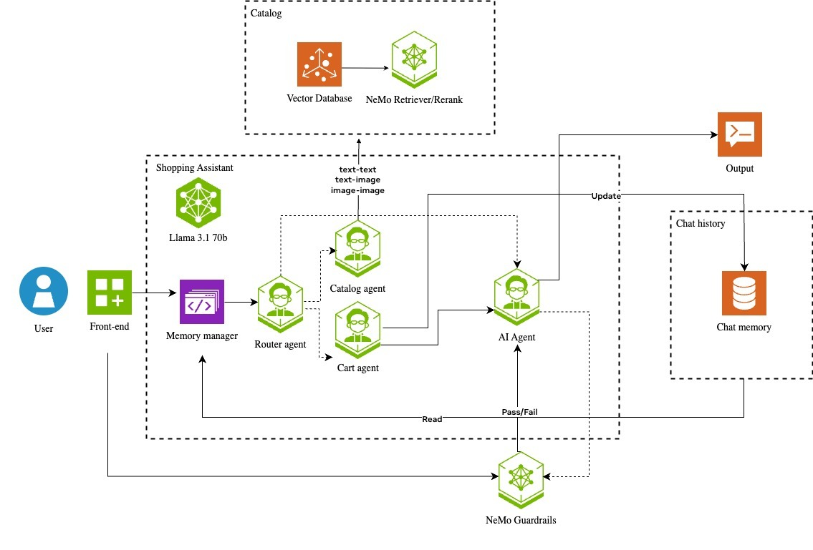

<a id="top"></a>
# 🛍️ NVIDIA AI Blueprint: Retail Shopping Assistant

<div align="center">


**AI-powered retail shopping assistant with Deep Agents SDK orchestration**

[](LICENSE)
[](https://www.python.org/)
[](https://www.docker.com/)
[](https://github.com/NVIDIA-AI-Blueprints/retail-shopping-assistant/stargazers)
[](https://github.com/NVIDIA-AI-Blueprints/retail-shopping-assistant/issues)
[](https://github.com/NVIDIA-AI-Blueprints/retail-shopping-assistant/commits)
[](https://github.com/NVIDIA-AI-Blueprints/retail-shopping-assistant/graphs/contributors)

</div>

## 📋 Table of Contents

- [Overview](#overview)
  - [Key Features](#key-features)
  - [Architecture](#architecture)
- [Get Started](#get-started)
  - [Prerequisites](#prerequisites)
  - [Quick Start](#quick-start)
- [Documentation](#documentation)
- [Contribution Guidelines](#contribution-guidelines)
- [Community](#community)
- [References](#references)
- [License](#license)

## Overview

The Retail Shopping Assistant is an AI-powered blueprint that provides a comprehensive interface for an intelligent retail shopping advisor. The chain server uses the Deep Agents SDK as the assistant harness over deterministic shopping tools, with SSE-framed responses, image-based search, optional VLM media perception, and intelligent shopping cart management.

### Key Features

- 🤖 **Intelligent Product Search**: The assistant translates natural language
  into catalog queries and advertised filters; the catalog performs only
  deterministic embedding retrieval and ranking
- 🛒 **Deterministic Cart Management**: Read, add, remove, update quantities,
  and compute subtotals through typed tools
- 🧠 **Configurable Conversation Checkpoints**: In-process memory for local
  development and tests, with Redis for shared durable production state;
  product-result refs remain a separate process-local cache
- 📚 **Enforced Shopper Skills**: Every turn first semantically selects and
  fully loads the smallest applicable skill set before shopping tools become
  available; product work uses one discovery or styling primary, with budget
  guidance only when the shopper states a budget
- 🖼️ **Visual Search**: Upload images to find similar products
- 🎥 **Optional VLM Media Perception**: Enable a VLM role to analyze image and video uploads in shopping context
- 💬 **Conversational AI**: Natural language interactions
- 🔒 **Configurable Content Safety**: Built-in moderation and safety checks are on by default and can be disabled per request or config
- ⚡ **SSE Response Stream**: Event-stream response framing for chat clients; token-level Deep Agents streaming is a follow-up after the harness migration
- 📊 **Inference Visibility**: Model names, call counts, token usage, and
  operator-facing ordered agent/tool termination diagnostics
- 📱 **Responsive UI**: Modern, mobile-friendly interface

### Architecture



The application follows a microservices architecture:
- **Chain Server**: Deep Agents SDK orchestration with five registered shopper
  skills, a required per-turn activation phase, nine deterministic shopping
  tools, capability-derived search schemas, bounded search-schema repair,
  grounded response assembly, optional read-only persona context, and a
  configurable conversation checkpointer
- **Catalog Retriever**: Generative-LLM-free text/image embedding search, hard
  filtering, normalized COSINE relevance scores, and deterministic result
  ranking
- **Memory Retriever**: User context and cart management
- **Guardrails**: Content safety and moderation
- **UI**: React-based frontend interface

For the serving-agent flow, see
[Shopper Agent Architecture](docs/SHOPPER_AGENT_ARCHITECTURE.md). The
[Documentation Hub](docs/README.md) links the detailed contracts and operations
guides.

### Catalog lifecycle and capability publishing

1. At startup, the catalog service loads `enriched_products.jsonl` and its
   field-role sidecar into one validated snapshot.
2. That snapshot supplies embedding documents, product details, filters, and
   the live contract at `http://localhost:8010/capabilities`.
3. On its first successful fetch, the chain server caches one process-wide
   contract shared by all sessions. Its aggregate endpoint at
   `http://localhost:8009/capabilities` returns the cached catalog contract with
   the other runtime capabilities.
4. Cached capabilities generate both the allowed taxonomy values and the
   non-taxonomy `required_constraints` properties. The agent semantically
   selects exact advertised values; deterministic chain code validates and maps
   them but does not interpret shopper language. Each call covers at most one
   category; a broad request may select the advertised subcategories that serve
   one focused product role.
5. An explicitly requested type with no faithful advertised value takes a
   no-retrieval path with empty taxonomy and no hard constraints. An unsupported
   modifier does not erase an advertised product type. A directly stated
   must-have missing from the generated schema is preserved in
   `unadvertised_requirements` so the runtime can refuse to present it as
   guaranteed instead of silently weakening it; subjective style remains
   semantic direction.
6. The catalog validates executable requests again, generates embeddings,
   applies hard filters, and ranks results. It performs no shopper-language
   interpretation or chat/completion call.

Successful search evidence preserves the model-authored semantic query as a
ranking preference. Search-only styling answers are assembled deterministically
from that direction plus tool-returned candidate facts and confirmed filters;
they label the direction as preference rather than product fact and nominate the
first ranked result, or one first result per requested role, without a separate
rationale model call. The grounding boundary keeps current-turn and prior-turn
tool-role evidence separate, so earlier results can resolve references but
cannot prove that a new search or cart mutation ran.

Final-response extraction ignores tool messages, assistant tool-call messages,
and internal skill-activation markers. If a completed graph contains no
shopper-facing answer, the runtime returns a safe retry response and records the
termination reason as `incomplete_agent_response` rather than exposing internal
content.

Product refs remembered for same-conversation follow-ups are process-local,
bounded, and valid only for the active catalog snapshot. Redis makes the Deep
Agents checkpoint durable; it does not persist that ref cache. A process
restart, another replica, cache eviction, or catalog replacement therefore
requires a fresh search before product details or cart adds. Optional persona
data is caller-provided advisory context, not trusted profile truth; production
callers must authenticate its owner and allowlist fields before forwarding it.

Catalog values are never copied into agent or catalog code. After replacing the
JSONL or sidecar, restart and verify the catalog service first, then restart and
verify the chain server so its process-lifetime cache matches the new snapshot.
See [Catalog Architecture](docs/CATALOG_REFACTOR_PLAN.md) for the complete flow
and [Catalog Schema and Filters](docs/CATALOG_FILTERS.md) for the sidecar rules.
The exact published response is documented in
[Catalog Retriever capabilities](docs/API.md#catalog-retriever-get-capabilities).

## Get Started

### Prerequisites

- **Docker**: Version 20.10+ with Docker Compose plugin
- **Python**: Host Python for deployment helpers. From the cloned repo, install
  deploy-helper dependencies with:
  ```bash
  python -m pip install --user -r requirements-deploy.txt
  ```
- **NVIDIA NGC Account**: For API access ([Get API Key](https://ngc.nvidia.com/))
- **Hardware**: 4x H100 GPUs (preferred) or 4x A100 GPUs (minimum) for local deployment, or cloud access

### Quick Start

1. **Clone the repository**:
   ```bash
   git clone https://github.com/NVIDIA-AI-Blueprints/retail-shopping-assistant.git
   cd retail-shopping-assistant
   ```

2. **Authenticate with NVIDIA Container Registry**:
   ```bash
   docker login nvcr.io
   ```
   Use `$oauthtoken` as the username and your NGC API key as the password.

3. **Install host deploy-helper dependencies**:
   ```bash
   python -m pip install --user -r requirements-deploy.txt
   ```

4. **Create and source an environment profile**:
   ```bash
   cp .env.example .env
   $EDITOR .env
   source .env
   ```

   Set `NVIDIA_API_KEY` in the file. The env file is a sourceable shell file;
   sourcing it also sets `COMPOSE_DISABLE_ENV_FILE=1` so Docker Compose uses
   the exported shell environment instead of auto-parsing repo-root `.env`.
   `CHECKPOINT_STORE=memory` is the local default. Production replicas should
   point `CHECKPOINT_STORE=redis` at an operator-managed Redis 8+ or Redis Stack
   service as described in the [Deployment Guide](docs/DEPLOYMENT.md).

5. **Validate and deploy**:
   ```bash
   python scripts/model_config.py show --validate
   python scripts/model_config.py deploy --build
   ```

   The helper prints resolved endpoints without printing API keys. By default,
   `shared/configs/models.yaml` uses NVIDIA Build hosted endpoints for the
   app LLM, text embeddings, image embeddings, and guardrails, and starts no
   local NIM containers. The `vlm` role uses a hosted endpoint by default for
   image/video media understanding in addition to image embedding search; set it
   to `disabled` in `models.yaml` when that capability should be off.

   For local NIMs, edit the desired model roles in
   `shared/configs/models.yaml` to `source: local_nim`, then run:
   ```bash
   # Set LOCAL_NIM_CACHE in the sourced env profile first.
   mkdir -p "$LOCAL_NIM_CACHE" && chmod a+w "$LOCAL_NIM_CACHE"
   python scripts/model_config.py show --validate
   python scripts/model_config.py deploy --build
   ```

   Model routing lives in `shared/configs/models.yaml`.

6. **Access the application**: Open your browser to `http://localhost:3000`

7. **Stop the containers**:

   **Application services**:
   ```bash
   docker compose -f docker-compose.yaml down
   ```

   **Local NIM services, if `models.yaml` started any**:
   ```bash
   docker compose -f docker-compose-nim-local.yaml down
   ```

For detailed installation instructions, see [Deployment Guide](docs/DEPLOYMENT.md).

## Deploy on NVIDIA Brev

For a streamlined cloud deployment experience, you can deploy the Retail Shopping Assistant on **NVIDIA Brev** using GPU Environment Templates (Launchables):

**[NVIDIA Brev Deployment Guide](docs/BREV.md)** - Complete step-by-step instructions for deploying on Brev

### Why Choose NVIDIA Brev?

- **One-Click Deployment**: Pre-configured GPU environments with automatic setup
- **Managed Infrastructure**: No need to manage servers or GPU clusters
- **Secure Access**: Built-in secure tunneling for web interface access  
- **Flexible Resources**: Choose from H100, A100, and other GPU configurations
- **Cost-Effective**: Pay only for actual usage time

The Brev deployment guide walks you through the entire process from creating a Launchable to accessing your fully functional retail shopping assistant.

## Documentation

- **[Project Status](STATUS.md)**: Current implementation, verification, quality qualification, and remaining risks
- **[User Guide](docs/USER_GUIDE.md)**: How to use the application
- **[API Documentation](docs/API.md)**: Complete API reference
- **[Catalog Schema and Filters](docs/CATALOG_FILTERS.md)**: JSONL field roles and data-derived filter capabilities
- **[Catalog Architecture](docs/CATALOG_REFACTOR_PLAN.md)**: Start here for JSONL ingest, lifecycle-cached capabilities, compact agent discovery, validation, and retrieval
- **[Commerce Contracts](docs/COMMERCE_CONTRACTS.md)**: Internal product, cart, and commerce tool contracts
- **[Shopper Agent Architecture](docs/SHOPPER_AGENT_ARCHITECTURE.md)**: Clean map of the published catalog, turn flow, skills, tools, and memory boundaries
- **[Shopper Agent Tool Registry](docs/SHOPPER_AGENT_TOOL_REGISTRY.md)**: Registered Deep Agents tools for the shopper-serving agent
- **[Shopper Agent Skill Registry](docs/SHOPPER_AGENT_SKILL_REGISTRY.md)**: Registered Deep Agents skills and markdown tuning loop
- **[Deep Agents Migration Plan](docs/DEEP_AGENTS_MIGRATION_PLAN.md)**: SDK migration, session isolation, tools, skills, and scaling notes
- **[Deep Agents Cart Tool Goal](docs/DEEP_AGENTS_CART_TOOL_GOAL.md)**: Minimal cart-tool smoke gate and constraints
- **[Deployment Guide](docs/DEPLOYMENT.md)**: Installation and setup instructions
- **[Testing and Evaluation](tests/README.md)**: Unit, integration, and
  Challenger/Judge workflows; multi-turn judging treats the actual generated
  conversation history as authoritative
- **[Documentation Hub](docs/README.md)**: Complete documentation index

## Contribution Guidelines

We welcome contributions! Please see our [Contributing Guide](CONTRIBUTING.md) for details on:

- Development setup and environment configuration
- Coding standards and best practices
- Testing guidelines and examples
- Pull request process and code review guidelines

## Community

- **GitHub Issues**: [Report bugs and feature requests](https://github.com/NVIDIA-AI-Blueprints/retail-shopping-assistant/issues)
- **Documentation**: [Comprehensive guides and references](docs/README.md)

## References

### NVIDIA AI Blueprints
- [NVIDIA AI Blueprints](https://github.com/NVIDIA-AI-Blueprints): Collection of AI application blueprints
- [NVIDIA NIM](https://catalog.ngc.nvidia.com/orgs/nim): Containerized AI models
- [NVIDIA NGC](https://ngc.nvidia.com/): AI platform and container registry

### Technologies Used
- [Deep Agents](https://docs.langchain.com/oss/python/deepagents/overview): Agent harness for tool and skill orchestration
- [LangGraph](https://github.com/langchain-ai/langgraph): Runtime used underneath Deep Agents
- [FastAPI](https://fastapi.tiangolo.com/): Modern Python web framework
- [React](https://reactjs.org/): JavaScript library for building user interfaces
- [Milvus](https://milvus.io/): Vector database for similarity search

### Related Projects
- [NVIDIA Retrieval QA](https://catalog.ngc.nvidia.com/orgs/nim/teams/nvidia/containers/nv-embedqa-e5-v5): Embedding model for semantic search
- [NV-CLIP](https://catalog.ngc.nvidia.com/orgs/nim/teams/nvidia/containers/nvclip): Visual understanding model for image retrieval
- [Nemotron 3 Super](https://catalog.ngc.nvidia.com/orgs/nim/teams/nvidia/containers/nemotron-3-super-120b-a12b): Large language model

## License

GOVERNING TERMS: Use of the blueprint software and materials and NIM containers are governed by the [NVIDIA Software License Agreement](https://www.nvidia.com/en-us/agreements/enterprise-software/nvidia-software-license-agreement/) and [Product-specific Terms for AI products](https://www.nvidia.com/en-us/agreements/enterprise-software/product-specific-terms-for-ai-products/);  and the use of models is governed by the [NVIDIA Community Model License](https://www.nvidia.com/en-us/agreements/enterprise-software/nvidia-community-models-license/).
 
ADDITIONAL INFORMATION: [Llama 3.1 Community License Agreement](https://www.llama.com/llama3_1/license/) for Llama 3.1 70B Instruct NIM, Llama 3.1 NemoGuard 8B - Content Safety and Llama 3.1 NemoGuard 8B - Topic Control models, built with Llama, (ii) MIT license for NV-EmbedQA-E5-v5.
 
This project will download and install additional third-party open source software projects. Review the license terms of these open source projects before use, found in [License-3rd-party.txt](/LICENSE-3rd-party.txt).
 
Use of the product catalog data in the retail shopping assistant is governed by the terms of the [NVIDIA Data License for Retail Shopping Assistant](/LICENSE-assets.txt) (15Aug2025).

---

<div align="center">

[Back to Top](#top)

</div>
