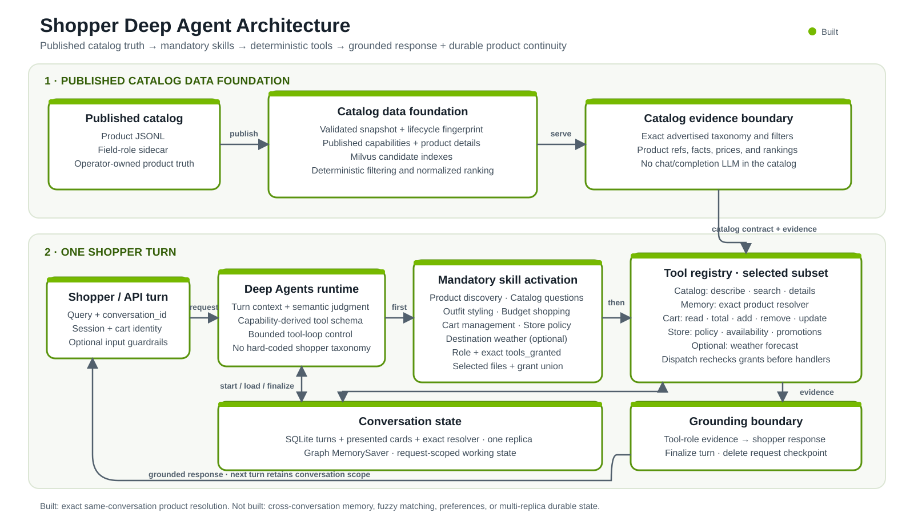

<a id="top"></a>
# 🛍️ NVIDIA AI Blueprint: Retail Shopping Assistant

<div align="center">


**A reference shopping assistant built on LangChain Deep Agents and open NVIDIA models**

[](LICENSE)
[](https://www.python.org/)
[](https://www.docker.com/)
[](https://github.com/NVIDIA-AI-Blueprints/retail-shopping-assistant/stargazers)
[](https://github.com/NVIDIA-AI-Blueprints/retail-shopping-assistant/issues)
[](https://github.com/NVIDIA-AI-Blueprints/retail-shopping-assistant/commits)
[](https://github.com/NVIDIA-AI-Blueprints/retail-shopping-assistant/graphs/contributors)

</div>

## 📋 Table of Contents

- [Overview](#overview)
- [Key Features](#key-features)
- [Architecture](#architecture)
- [Get Started](#get-started)
- [Notebooks](#notebooks)
- [Documentation](#documentation)
- [Contribution Guidelines](#contribution-guidelines)
- [Community](#community)
- [References](#references)
- [License](#license)

## Overview

The Retail Shopping Assistant is a reference conversational shopping advisor
built on open tooling: LangChain's
[Deep Agents](https://docs.langchain.com/oss/python/deepagents/overview) as the
agent harness, and open NVIDIA Nemotron models for reasoning, perception and
safety. Shoppers type, or upload a photo or a short video.

It ships a representative catalog — apparel, footwear, bags, eyewear and
jewelry, with real images, prices, sizes, materials and colors — and that catalog declares which of its own fields become
shopper-facing filters. Point the service at your own data and the search
contract follows. Retrieval stays deterministic: the agent writes the query,
and the catalog service does the embedding search and ranking.

It is a complete reference rather than a demo. The notebooks carry one
deployment the whole way: stand it up, read a single turn's traces, replay
conversations to tell flaky from broken, then serve the model on your own GPUs
and measure time to first token and throughput under load.

Run it on NVIDIA-hosted endpoints with no GPU, or serve the models yourself.

## Key Features

- **Natural-language product search** — the agent plans the query, the catalog retrieves deterministically
- **Photo and video understanding** — Nemotron 3.5 Super VL reads uploads in shopping context
- **Deterministic cart** — typed tools, with totals computed in code rather than generated
- **Skills with enforced tool grants** — each skill declares its tools, and the grant is rechecked at dispatch
- **Durable conversation turns** — a turn's outcome and the products it showed survive a restart
- **Representative shopper profiles** — five database-backed shoppers, or Guest
- **Optional content safety and topic control** — separate guard models, off by default
- **SSE response streaming** — products, images, text, and metrics as discrete events
- **Per-turn observability** — which skill ran, what the model was told, and why a tool was refused

## Architecture



[Open the architecture diagram at full size](docs/images/shopper-agent-architecture.svg).

Five services, each owning one concern:

| Service | Owns |
|---------|------|
| **Chain Server** | The Deep Agents turn: skill activation, tool dispatch, grounded response assembly |
| **Catalog Retriever** | Embedding search, hard filtering, and deterministic ranking. No generative model |
| **Memory Retriever** | Durable turns, cart state, presented-product history, and shopper profiles |
| **Guardrails** | Content safety and topic control, when enabled |
| **UI** | React front end with shopper selection and per-turn detail |

A turn starts a durable record before any model work, activates the smallest
applicable skill set, dispatches only the tools those skills grant, and
assembles a reply from tool evidence. [Assistant
Architecture](docs/ASSISTANT_ARCHITECTURE.md) walks through it in full,
including the catalog data foundation and the memory boundaries.

## Get Started

Every model runs on a hosted NVIDIA endpoint, so this path needs **no GPU**.

**You need** Docker 20.10+ with the Compose plugin, Python on the host, an
NVIDIA API key from [build.nvidia.com](https://build.nvidia.com), and an
[NGC account](https://ngc.nvidia.com/) to pull the UI base image.

```bash
git clone https://github.com/NVIDIA-AI-Blueprints/retail-shopping-assistant.git
cd retail-shopping-assistant

docker login nvcr.io                 # username: $oauthtoken, password: NGC API key
python -m pip install --user -r requirements-deploy.txt

cp .env.example .env
$EDITOR .env                         # set NVIDIA_API_KEY
source .env

python scripts/model_config.py show --validate   # every model role resolves; no keys printed
python scripts/model_config.py deploy --build
curl -s http://localhost:8010/ready  # catalog: 503 until the index is built
```

Then open **http://localhost:3000**, and continue with
[Notebook 1](notebook/1_Getting_Started.ipynb).

**Running the models on your own GPUs instead?** The default layout needs five
GPUs, as on an 8x H100 80 GB machine. See
[Locally Hosted Models](docs/DEPLOYMENT.md#-locally-hosted-models) for the GPU
sizing, setup, and model metrics. No GPUs of your own?
[NVIDIA Brev](https://developer.nvidia.com/brev) offers pay-as-you-go GPU
instances; [docs/BREV.md](docs/BREV.md) has a walkthrough.

## Notebooks

The notebooks take the deployment you just made and teach what it does. They
are the fastest way to understand this blueprint, and the best place to start
after the UI loads.

| Notebook | You will | Time | GPU |
|---|---|---|---|
| [1 · Getting Started](notebook/1_Getting_Started.ipynb) | deploy on hosted endpoints, hold a first conversation, and call each component once | ~20 min | No |
| [2 · Observability](notebook/2_Observability.ipynb) | read a turn's traces: skills, prompts, tool calls, refusals, time and tokens | ~20 min | No |
| [3 · Evaluation](notebook/3_Evaluation.ipynb) | replay conversations, investigate a failure, tell flaky from broken, run the Challenger and Judge | ~30 min | No |
| [4 · Capture Traces](notebook/4_Capture_Traces.ipynb) | record every model call of the journeys as an AIPerf trace, for Notebook 5 to replay | ~35 min | No |
| [5 · Performance Measurement](notebook/5_Performance_Measurement.ipynb) | serve Nemotron with vLLM and measure prefix-cache hit rate, TTFT, and throughput by concurrency | hours | Yes |

Notebook 2 is the one to read if you only read one: it shows you what the model
was actually told on a given turn, which is how you tell "the model ignored the
rule" from "the model never saw the rule".

See [notebook/README.md](notebook/README.md) for prerequisites and how to start
Jupyter.

## Documentation

[Documentation Hub](docs/README.md) indexes everything and suggests a path for
your role.

1. **[User Guide](docs/USER_GUIDE.md)** — using the assistant: chat, search, cart, uploads, FAQ
2. **[Assistant Architecture](docs/ASSISTANT_ARCHITECTURE.md)** — the catalog foundation, one shopper turn, and memory boundaries
   - **[Skills](docs/SKILLS.md)** — registered skills, runtime loading, and the markdown tuning loop
   - **[Tools](docs/TOOLS.md)** — registered tools, risk classes, and per-skill access boundaries
3. **[Observability](docs/OBSERVABILITY.md)** — read a session turn by turn, and dig into why one turn did what it did
4. **[Testing and Evaluation](tests/README.md)** — unit, integration, and Challenger/Judge workflows
5. **[Performance Measurement](docs/PERFORMANCE.md)** — latency budget, saturation point, and deployment sizing
6. **[Deployment and Configuration](docs/DEPLOYMENT.md)** — both deployment paths, and every configuration setting with its default
7. **[API Reference](docs/API.md)** — endpoints, request and response models, and streaming frames
8. **[Catalog Architecture](docs/CATALOG_ARCHITECTURE.md)** — the data format, declaring which fields become shopper-facing filters, and reindexing onto your own catalog
9. **[Guardrails](docs/GUARDRAILS.md)** — the optional safety layer: how it decides, what a failed check costs, and how to turn it on

Contributors should also read [AGENTS.md](AGENTS.md), the service map and file
layout for this codebase.

## Contribution Guidelines

We welcome contributions. [Contributing](CONTRIBUTING.md) covers the fork and
pull-request workflow, the sign-off we require on every commit, and the
Developer Certificate of Origin. [Code of Conduct](CODE_OF_CONDUCT.md) applies
to everyone taking part.

For development setup see [Deployment](docs/DEPLOYMENT.md), and for running the
suites see [Testing and Evaluation](tests/README.md).

## Community

- **GitHub Issues**: [Report bugs and feature requests](https://github.com/NVIDIA-AI-Blueprints/retail-shopping-assistant/issues)
- **Documentation**: [Comprehensive guides and references](docs/README.md)

## References

### NVIDIA AI Blueprints
- [NVIDIA AI Blueprints](https://github.com/NVIDIA-AI-Blueprints): Collection of AI application blueprints
- [NVIDIA NGC](https://ngc.nvidia.com/): AI platform and container registry
- [build.nvidia.com](https://build.nvidia.com): Hosted model endpoints and API keys

### Technologies Used
- [Deep Agents](https://docs.langchain.com/oss/python/deepagents/overview): Agent harness for tool and skill orchestration
- [LangGraph](https://github.com/langchain-ai/langgraph): Runtime used underneath Deep Agents
- [vLLM](https://github.com/vllm-project/vllm): Inference server for locally hosted models
- [FastAPI](https://fastapi.tiangolo.com/): Modern Python web framework
- [React](https://reactjs.org/): JavaScript library for building user interfaces
- [Milvus](https://milvus.io/): Vector database for similarity search

### Models
- [Nemotron 3.5 Super VL](https://docs.nvidia.com/nemo/automodel/model-coverage/omni/nvidia/nemotron-3-5-super-vl): Shopping agent, and photo and video perception
- [Nemotron 3 Embed 1B](https://build.nvidia.com/nvidia/nemotron-3-embed-1b/modelcard): Catalog and query embedding
- [Nemotron 3.5 Content Safety](https://catalog.ngc.nvidia.com/orgs/nim/teams/nvidia/containers/nemotron-3.5-content-safety): Optional moderation of shopper input and assistant output
- [Llama 3.1 NemoGuard 8B Topic Control](https://build.nvidia.com/nvidia/llama-3_1-nemoguard-8b-topic-control): Optional off-topic detection

## License

GOVERNING TERMS: Use of the blueprint software and materials and NIM containers are governed by the [NVIDIA Software License Agreement](https://www.nvidia.com/en-us/agreements/enterprise-software/nvidia-software-license-agreement/) and [Product-specific Terms for AI products](https://www.nvidia.com/en-us/agreements/enterprise-software/product-specific-terms-for-ai-products/);  and the use of models is governed by the [NVIDIA Community Model License](https://www.nvidia.com/en-us/agreements/enterprise-software/nvidia-community-models-license/).
 
ADDITIONAL INFORMATION: [Llama 3.1 Community License Agreement](https://www.llama.com/llama3_1/license/) for the Llama 3.1 NemoGuard 8B - Topic Control model, built with Llama.
 
This project will download and install additional third-party open source software projects. Review the license terms of these open source projects before use, found in [License-3rd-party.txt](LICENSE-3rd-party.txt).
 
Use of the product catalog data in the retail shopping assistant is governed by the terms of the [NVIDIA Data License for Retail Shopping Assistant](LICENSE-assets.txt) (15Aug2025).

---

<div align="center">

[Back to Top](#top)

</div>
