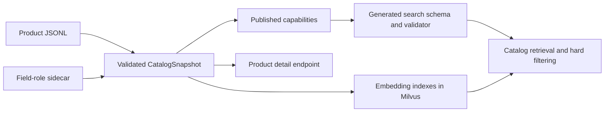
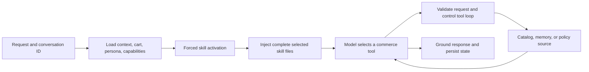

# Shopper Agent Architecture

This document is the short architectural map of the serving shopper agent. It
shows where product truth is published, how skills control model behavior, and
which tools connect the agent to application services.

## Architectural Boundaries

| Boundary | Owns | Does not own |
| --- | --- | --- |
| Published catalog | Product records, taxonomy, filter values, field roles, prices, details, and retrieval results | Shopper intent, styling judgment, cart state, or inventory |
| Deep Agents runtime | Semantic intent, skill selection, tool selection, and styling judgment | Product facts, policy facts, or cart truth |
| Memory and checkpointer | Recent conversation context, graph checkpoints, and authoritative cart state | Catalog facts, durable product-ref authorization, or permission to invent stale product details |

A model-authored semantic query is a **ranking preference**, not a product fact.
Only catalog tool evidence can establish catalog facts. Persona and conversation
memory may guide judgment, but neither can override current tool results.
Caller-supplied persona data is untrusted; production callers must authenticate
its owner and allowlist fields before forwarding it.

## 1. Published Catalog Data Foundation

The catalog starts from two operator-published files:

- [Product JSONL](../shared/data/enriched_products.jsonl) supplies product rows
  and all observed values.
- [Field-role sidecar](../shared/data/enriched_products.schema.yaml) identifies
  record fields, ordered taxonomy fields, and whether each field supports hard
  filtering, semantic retrieval, or product details. It does not duplicate
  catalog values.

One validated snapshot supplies capabilities, product details, and the data
indexed in Milvus. `GET /capabilities` publishes the exact current taxonomy,
filter values, numeric ranges, field coverage, and supported retrieval modes.
The chain server caches the first successful contract and uses it both to
generate `search_catalog_tool` inputs and to validate every structured search.

The shopper model owns the semantic mapping from the request to advertised
values. Deterministic code verifies those values before retrieval. The catalog
service contains no chat/completion LLM and does not interpret shopper language,
expand queries, or choose filters. Its only model inference is text or image
embedding generation; candidate fusion, hard filtering, COSINE relevance
normalization, deduplication, and final ordering are deterministic.

Each search covers at most one catalog category and one focused product role.
The duplicate identity is normalized taxonomy plus hard constraints, not
semantic wording. A concrete requested type with no faithful advertised value
uses the no-retrieval path with empty taxonomy and no hard constraints; an
unsupported modifier does not erase an otherwise advertised type.

The detailed contracts and implementation live in:

- [Catalog architecture](CATALOG_REFACTOR_PLAN.md)
- [Commerce contracts](COMMERCE_CONTRACTS.md)
- [Catalog loader](../catalog_retriever/src/catalog.py)
- [Capability publisher](../catalog_retriever/src/capabilities.py)
- [Catalog retriever](../catalog_retriever/src/retriever.py)
- [Chain capability cache](../chain_server/src/catalog_capabilities.py)

## 2. One Shopper Turn

1. The runtime scopes the request, loads recent context and the authoritative
   cart from the memory service, and uses `conversation_id` as the LangGraph
   checkpoint thread. Optional caller-supplied persona data is read-only,
   advisory context.
2. The first model step can call only `activate_shopper_skills_tool`. It selects
   the smallest registered skill set for the current intent.
3. The runtime validates the selection and injects the complete selected
   `SKILL.md` files. Commerce tools become available only on the next model
   step; activation therefore cannot be bypassed or batched with shopping work.
4. The model chooses among nine commerce tools. Catalog requests pass through
   the capability-derived schema and deterministic validation. Tool calls are
   sequential, duplicate taxonomy-plus-hard-constraint scopes are rejected, and
   one bounded search repair is available. A successful repaired partial search
   may continue with another valid role, but no second repair is available.
5. Tool-role messages are the evidence boundary. Search-only styling responses
   are assembled deterministically from candidate facts, confirmed filters, and
   the explicitly labelled ranking preference. They nominate the first ranked
   result, or one first result per requested role. Other tool-backed drafts pass
   through the grounding boundary before they become shopper-facing text.
6. The runtime persists a bounded recent transcript to the memory service and
   the Deep Agents graph state to the configured checkpointer. In-process
   checkpoints are for development and tests; Redis supports shared durable
   production threads.

Final-response extraction ignores tool messages, assistant tool-call messages,
and internal activation markers. If no shopper-facing answer remains, the
runtime returns a safe retry response and records `incomplete_agent_response`.

Product refs used for follow-up detail reads and cart adds are a separate,
bounded process-local cache. They are not persisted by Redis, so a restart,
another replica, eviction, or catalog replacement requires a fresh search.

The serving implementation is split across the
[Deep Agents runtime](../chain_server/src/deepagents_runtime.py),
[skill activation boundary](../chain_server/src/skill_activation.py), and
[tool-loop controller](../chain_server/src/tool_loop_control.py).

## 3. Skills and Their Tools

Five shopper skills are registered. This table is a behavioral map, not a
per-skill authorization list: after successful activation, all nine commerce
tools are technically exposed. Skill instructions guide the model, while tool
schemas and wrappers independently enforce refs, intent, filters, and mutation
preconditions.

| Skill | Use | Expected tools |
| --- | --- | --- |
| [`product-discovery`](../chain_server/skills/shopper/product-discovery/SKILL.md) | Primary procedure for non-styling search, browse, filters, and product facts | `search_catalog_tool`, `get_product_details_tool`, `check_product_availability_tool` |
| [`outfit-styling`](../chain_server/skills/shopper/outfit-styling/SKILL.md) | Primary procedure for building, completing, comparing, balancing, or refining a look | `search_catalog_tool`, `get_product_details_tool`, `check_product_availability_tool`, `get_cart_tool`, `view_cart_total_tool`; cart mutation tools only with explicit cart intent |
| [`budget-shopping`](../chain_server/skills/shopper/budget-shopping/SKILL.md) | Modifier when the shopper states a price ceiling or bundle budget | `search_catalog_tool`, `get_product_details_tool`, `check_product_availability_tool`, `get_cart_tool`, `view_cart_total_tool` |
| [`cart-management`](../chain_server/skills/shopper/cart-management/SKILL.md) | Explicit cart reads, adds, removals, and quantity changes | `get_cart_tool`, `view_cart_total_tool`, `add_cart_items_tool`, `remove_cart_item_tool`, `update_cart_items_tool` |
| [`store-policy-answers`](../chain_server/skills/shopper/store-policy-answers/SKILL.md) | Returns, shipping, sizing, payment, price matching, and gift cards | `get_store_policy_tool` |

`product-discovery` and `outfit-styling` are mutually exclusive primary
procedures. `budget-shopping` modifies the applicable primary only when the
shopper states a budget. A genuine multi-intent turn activates every needed
skill once; for example, styling under a budget with an explicit add request
uses `outfit-styling`, `budget-shopping`, and `cart-management`.

[trends-current.md](../chain_server/skills/shopper/trends-current.md) is a
read-only seasonal reference used by `outfit-styling`; it is not a registered
skill and is not catalog truth.

## 4. Tool Ownership

| Tool group | Tools | Source of truth |
| --- | --- | --- |
| Catalog | `search_catalog_tool`, `get_product_details_tool` | Active published catalog snapshot |
| Availability boundary | `check_product_availability_tool` | Deliberate application stub; always returns `unknown` until inventory exists |
| Cart | `get_cart_tool`, `view_cart_total_tool`, `add_cart_items_tool`, `remove_cart_item_tool`, `update_cart_items_tool` | Memory service cart |
| Policy | `get_store_policy_tool` | Operator-managed policy YAML |

`activate_shopper_skills_tool` is an internal control tool, not a commerce
tool. It is forced at turn start and selects static behavior instructions; it
does not read or mutate catalog, cart, or policy state.

For exact input schemas, risk classes, and failure behavior, use the
[Shopper Agent Tool Registry](SHOPPER_AGENT_TOOL_REGISTRY.md). For skill
selection and tuning details, use the
[Shopper Agent Skill Registry](SHOPPER_AGENT_SKILL_REGISTRY.md).
