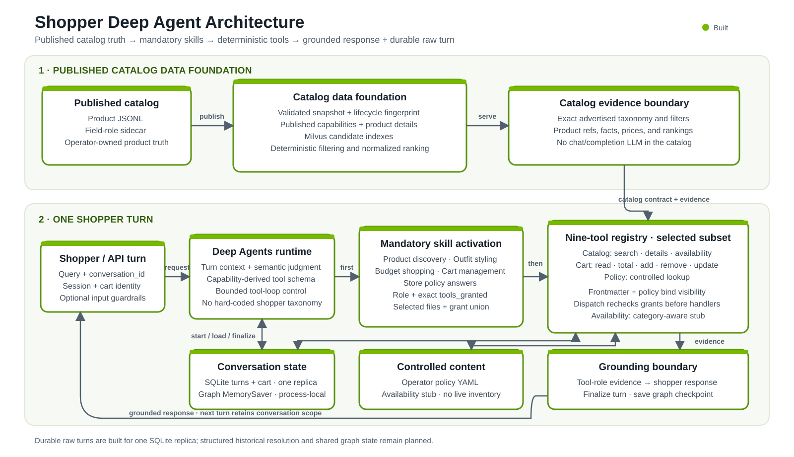

# Shopper Agent Architecture

This document is the short architectural map of the serving shopper agent. It
shows where product truth is published, how skills control model behavior, and
which tools connect the agent to application services.

## Architecture at a Glance



[Open the full-size SVG](images/shopper-agent-architecture.svg).

For the concise executive flow, worked example, and prioritized follow-up work,
see the [Shopper Agent Leadership Note](SHOPPER_AGENT_LEADERSHIP_NOTE.md).

## Architectural Boundaries

| Boundary | Owns | Does not own |
| --- | --- | --- |
| Published catalog | Product records, taxonomy, filter values, field roles, prices, details, and retrieval results | Shopper intent, styling judgment, cart state, or inventory |
| Deep Agents runtime | Semantic intent, skill selection, deterministic selected-skill tool grants, tool selection, styling judgment, and one server-resolved representative-shopper soft-guidance block | Product facts, policy facts, cart truth, or profile ownership |
| Memory service | Immutable representative-shopper registry and conversation binding, typed three-field shopper snapshots, ordered durable shopper/assistant turns, exact finalized replay, negotiated rolling semantic summary plus bounded raw/source lanes, presented-product events and compact index, deterministic same-conversation reference resolution, authoritative cart state, and atomic mutation replay records | Catalog facts, model reasoning, learned preferences, sentiment, active anchors, or cross-conversation memory |
| Graph checkpointer | Request-scoped working graph/tool state within one chain-server process | Durable transcript storage, cross-turn shopper memory, cross-replica context, or product-ref authorization |
| Dormant weather boundary | Closed US ZIP/date request validation, one provider adapter, normalized daily forecast evidence, and sanitized typed failures | Shopper selection, relative-date interpretation, model context, agent registration, styling advice, persistence, or public API |

A model-authored semantic query is an internal **ranking preference**, not a
product fact or shopper-facing explanation. Only catalog tool evidence can
establish catalog facts. Conversation memory may guide judgment, but it cannot
override current tool results. Caller-supplied persona objects are not injected
into model context. The UI may send only one server-published profile ID;
memory resolves and binds it at turn start. The runtime renders the returned
type, behavior, and ZIP once as soft guidance. That context never grants a
skill/tool or establishes budget, constraints, cart intent, or product facts.

Slice 3 also contains a dormant `get_weather_forecast_tool` factory backed by a
provider-neutral client contract. Its wrapper is directly testable, but neither
the wrapper nor its schema is supplied to `create_deep_agent`, the shopping-tool
policy, a shopper skill, a prompt, FastAPI, or the UI. It does not read the
saved ZIP or any shopper identity. Disabled startup and health checks make no
weather request.

## 1. Published Catalog Data Foundation

The catalog starts from two operator-published files:

- [Product JSONL](../shared/data/enriched_products.jsonl) supplies product rows
  and all observed values.
- [Field-role sidecar](../shared/data/enriched_products.schema.yaml) identifies
  record fields, ordered taxonomy fields, and whether each field supports hard
  filtering, semantic retrieval, or product details. It does not duplicate
  catalog values.

One validated snapshot supplies capabilities, product details, and the data
indexed in Milvus. `GET /capabilities` publishes the exact current taxonomy,
filter values, numeric ranges, field coverage, and supported retrieval modes.
The chain server caches the first successful contract and uses it both to
generate `search_catalog_tool` inputs and to validate every structured search.

The shopper model owns one semantic catalog search. `search_catalog_tool`
exposes `semantic_query`, `shopper_guidance`, `requested_product_type`,
`taxonomy`, `required_constraints`, `scope_complete`, and optional
`search_mode`. Catalog capabilities generate its exact taxonomy values,
hard-filter properties and enum values, typed numeric ranges, and search modes.
It exposes no model-authored taxonomy relationship, clarification branch, or
catalog-absence result. The schema omits cross-field validators. The handler revalidates it with the existing
strict semantic search model. Invalid individual values fail at the typed tool
boundary; cross-field failures reach capability-aware handler validation.
Deterministic code verifies and maps valid values before retrieval. The catalog
service contains no chat/completion LLM and does not interpret shopper language,
expand queries, or choose filters. Its only model inference is text or image embedding generation;
candidate fusion, hard filtering, COSINE relevance normalization, deduplication,
and final ordering are deterministic.

Each search covers at most one catalog category and one focused product role.
Every text search carries `requested_product_type`: the shortest product noun or
true umbrella from the shopper's current turn or direct antecedent, excluding
color, material, fit, occasion, weather, and style modifiers. This field records
provenance, not taxonomy or ranking text, and is `null` only for image-only search.
Literal validation can bind the longest exact advertised suffix in a
modifier-bearing model phrase (`waterproof boots` to `boots`). It disables that
shortcut for explicit alternatives containing `and`, `or`, `/`, or `&`, so `closed
shoes or boots` remains model-owned alternative or umbrella reasoning.
The model owns alternative, comparison, ordering, and negation semantics; the
runtime does not extract alternative members from shopper prose. A typed
selection of multiple advertised subcategories from one category executes once
with a selection-wide candidate window. Rank-preserving selection keeps one
returned candidate per selected subcategory when available and trims to the
configured result count.
The `semantic_query` remains independent soft ranking direction. The model owns
advertised taxonomy selection. Capability-owned exact category/subcategory
relationships validate that selection. A genuinely open role is valid only
when it selects exactly one advertised subcategory and names that value in
`requested_product_type`; that path is rejected for a shopper-named scope. If an
open-role call is malformed,
deterministic validation stops before retrieval and reports the exact eligible
advertised subcategories from the current capability contract. It returns
related constraint and `shopper_guidance` defects in that same repair result.
This is bounded schema feedback, not semantic routing: the model operating under
the active skill still selects the role.
The duplicate identity is normalized taxonomy plus hard constraints, not
semantic wording. A shopper-named type that is not separately advertised may
use one model-selected faithful advertised parent category, with the original
type retained as semantic direction and structured evidence requiring honest
closest-alternative framing. If neither a direct advertised type nor one
faithful parent can be selected, the assistant asks one concise clarification
directly without a tool call rather than substituting or asserting catalog
absence. An unsupported modifier does not erase an otherwise advertised type.

The detailed contracts and implementation live in:

- [Catalog architecture](CATALOG_REFACTOR_PLAN.md)
- [Commerce contracts](COMMERCE_CONTRACTS.md)
- [Catalog loader](../catalog_retriever/src/catalog.py)
- [Capability publisher](../catalog_retriever/src/capabilities.py)
- [Catalog retriever](../catalog_retriever/src/retriever.py)
- [Chain capability cache](../chain_server/src/catalog_capabilities.py)
- [Model-visible catalog search schema and tool construction](../chain_server/src/deepagents_runtime.py)
- [Reusable model-visible catalog search rules](../chain_server/src/catalog_scope.py)

## 2. One Shopper Turn

1. The runtime scopes the request and starts a durable memory-service turn before
   guardrail, model, or tool work, explicitly negotiating response contract v2.
   That transaction returns three separate context lanes: a durable semantic
   summary, bounded exact model-context-eligible raw turns strictly after its
   watermark, and a compact historical-product index. It also returns a bounded
   exact oldest raw prefix that only the summary compactor may consume, the prior
   turn's selected skill names, the authoritative cart, and an opaque execution
   `attempt_id`. The summary is continuity guidance, never exact evidence or
   authority for products, cart, tools, policy, availability, or permissions.
   Blocked turns stay durable for exact replay and audit but are excluded from
   both the service projection and chain prompt formatter. LangGraph working
   state is isolated to this request under a collision-safe pair of conversation
   ID and request ID.
2. The first model step can call only `activate_shopper_skills_tool`. It selects
   the smallest registered skill set for the current intent. The prior turn's
   selected skill names, persisted with the prior terminal turn, are included
   only as a read-only continuity signal for this fresh semantic decision. They
   do not force routing, inject the old skill, or authorize commerce tools. The
   conversation still establishes intent: a
   terse item-only follow-up inside an active outfit-building or style-led
   single-piece thread remains an `outfit-styling` task. An invalid composition
   returns its typed reason to the activation model for one correction. A second
   invalid composition ends the graph with a deterministic clarification and
   exposes no shopping tool. Multiple activation calls in one model response
   execute none and produce the generic shopping-task clarification immediately.
3. The runtime validates the selection and injects the complete selected
   `SKILL.md` files. Each file declares `role`, optional `exclusive_group`, and
   `tools_granted`; only the union of those grants becomes model-visible on the
   next step. Activation therefore cannot be bypassed or batched with shopping
   work. Each skill's required frontmatter also supplies declarative
   `response_guidance`: reviewed shopper-facing fallback framing for a search
   call whose tool evidence contains no `shopper_guidance`.
4. The model chooses only from the selected skills' granted tools. Every
   app-owned shopping dispatch independently rechecks both the frontmatter grant
   union and the immutable execution policy before its handler can run. Before
   a detail, availability, or cart operation uses a product from an earlier
   turn, the selected discovery, styling, or cart skill may call the typed
   historical resolver once with one or more exact descriptors from the compact
   index. Its 0/1/many result requires clarification for zero or many; only one
   match enters request-local product evidence. Resolution is deterministic and
   makes no catalog, embedding, or separate model call. An established
   two-product styling comparison remains inside `outfit-styling`: the model
   submits all missing prior products in that one resolver call, then reads
   each unique ref through the scalar detail tool in separate model steps. The
   default two-read cap covers one pair; an unauthorized ref performs no
   catalog read and consumes no read budget. Any required zero/many result
   clarifies without a substitute search. This is semantic skill procedure, not a
   deterministic comparison-intent gate. Before
   retrieval, every text search includes one nonempty, product-agnostic
   `shopper_guidance` sentence authored under the active skill; image-only search
   uses empty guidance. A shopper-named type not separately advertised may use
   one model-selected faithful advertised parent category; the search result
   records that relation so synthesis cannot relabel the returned products.
   If neither a direct type nor one faithful parent can be selected, the
   assistant asks one concise clarification directly and makes no search-tool call. Search
   requests pass through the capability-derived schema and deterministic
   validation. Tool calls are
   sequential and duplicate taxonomy-plus-hard-constraint scopes are rejected.
   Repair accounting uses
   the full normalized `requested_product_type` phrase rather than only its last
   noun. It does not reconstruct an alternative set from shopper prose or treat
   connector and ordering changes as deterministic semantic equivalence. Each
   scope receives one total repair. A schema correction or a fresh
   constraint-provenance review can consume that shared budget; constraint
   feedback returned by an in-flight schema repair closes the loop for synthesis
   rather than opening another repair. The repair is isolated: it receives the
   capability-derived typed `search_catalog_tool`, compact server-generated
   Catalog capabilities, the current shopper message, bounded sanitized
   validator feedback, and the complete active shopper-skill instructions. Only
   `search_catalog_tool` is available and parallel calls are disabled. The
   repair may submit one corrected search or return no tool call to signal that
   clarification is needed. That no-tool response is only
   branch/control state: the server marks it, discards the model prose, and
   emits `Could you clarify the product type or requirement you want me to
   use?`. Grounded products from any successful requested scope are preserved
   before that clarification. Successful evidence from another shopping tool
   is combined with the fixed clarification by the existing grounding editor.
   Active-skill responses containing more than one shopping tool call are
   rejected before execution, so repair state always belongs to one call.
   Its messages contain only the current shopper
   message and bounded, sanitized validator feedback in a separate Human data
   message. Echoed rejected arguments are stripped; native Pydantic feedback is
   reduced to rejected top-level field names, and unbounded requested-scope text
   is never copied into the repair message. Invalid AI/tool history and the rest
   of the conversation are absent. For a native tool-transport failure, runtime locks the requested
   scope only when current or recent shopper text grounds it; an ungrounded
   model-generated scope may be corrected. A change to a grounded free-form
   locked scope that cannot be reconstructed safely is removed before execution
   and recorded in `agent_diagnostics` with reason `repair_scope_changed`. For
   any strict request failure with independently
   valid constraints, runtime snapshots the capability-validated advertised
   `required_constraints` privately and includes that exact finite object,
   including an explicit empty object, in the isolated feedback. This bounded
   capability-derived object is the exception to excluding free-form rejected
   arguments. The repaired call must preserve that finite constraint object;
   the strict handler rejects drift instead of overwriting model output. Repair
   middleware never restores or rewrites taxonomy, constraints, requested type,
   or search mode. It may restore only the independently valid structural
   `scope_complete` flag; bounded tool-call diagnostics expose that field name
   in `restored_fields`.
   The model remains responsible for correcting taxonomy; accepted modifier
   removal cannot bypass the lock, and list-valued filters compare canonically.
   When open-role validation fails, the same bounded feedback distinguishes a
   shopper-named role from a genuinely open one, allowing the repair to correct
   both schema and provenance errors. A shopper-named role retains the
   shopper's noun or umbrella; a genuinely open role selects and names one
   advertised subtype. The same repair may return no tool call to signal that
   clarification is needed; its prose is replaced by the fixed server-authored
   clarification above. A native
   failure confined to `required_constraints` receives sanitized field feedback
   together with the typed tool and compact Catalog capabilities while
   continuing to exclude free-form scope, query, and guidance text. Scope
   comparison remains private. Middleware does not reconstruct or overwrite
   rejected catalog values. A changed shopper-grounded scope closes as
   `repair_scope_changed`. A native
   schema-invalid call containing malformed or nonempty free-form
   `unadvertised_requirements` arguments closes without repair. A schema-valid,
   genuinely open request retains the bounded review for
   a proposed inferred requirement. Every unadvertised requirement on a
   shopper-stated product scope fails closed before retrieval, including when
   the model uses a synonym rather than the shopper's exact wording. The bounded
   constraint review is reserved for a proposed inferred requirement on a
   genuinely open role when the shared scope budget remains. It freezes
   requested type, taxonomy, completion
   state, `search_mode`, and all advertised hard constraints. Within that
   preserved hard scope, it may correct only the soft `semantic_query`, the
   reviewed unadvertised-requirement lane, and its associated
   `shopper_guidance`; the requirement is either replaced with the shopper's
   shortest exact wording or removed. Exact wording, unresolved provenance, and
   constraint feedback after a schema repair fail safe and close the loop.
   Removal scrubs the product-attribute claim from `shopper_guidance`. When a
   runtime semantic open-role schema repair removes its
   proposed inferred requirement, runtime replaces the submitted pre-search
   guidance with neutral generic guidance for the selected role. A successful
   partial search may continue with another valid role and its own single repair
   opportunity. The configured turn cap remains three searches. A successful or
   zero-result search that consumes the final slot records
   `SEARCH_BUDGET_EXHAUSTED`; the next model step removes only
   `search_catalog_tool`. Product-detail, availability, and cart tools plus
   honest partial synthesis remain available.
5. Tool-role messages are the evidence boundary. For completed successful
   search-only turns, the runtime runs one final tools-disabled synthesis under
   the active skill, then grounds that draft against tool-role evidence. If the
   draft or editor is unavailable, pre-retrieval `shopper_guidance` and static
   skill `response_guidance` feed deterministic fallback. When the requested
   outcome depends on a material, fit, comfort, durability, care, weather, or
   other functional property absent from evidence, grounding must disclose the
   gap and present candidates as the closest catalog or styling direction, not
   as proven suitable. Deterministic fallback makes the same generic
   unverified-property disclosure. Before fallback
   guidance is serialized, a narrow scrub replaces documented unsupported
   outdoor/weather guarantee terms with neutral selected-role guidance. It does
   not change the semantic query, taxonomy, constraints, or executed search.
   Covered forms include outdoor-surface or outdoor-walking claims and
   constructions such as "handle rain," "work well for outdoor surfaces," or
   "stay secure for outdoor walking," plus `wet conditions` and "works well in
   wet weather/conditions."
   Results, filters, and the assistant draft are not copied into guidance after
   retrieval.
   Deterministic fallback code separately renders every returned candidate with name,
   price, category, and only the confirmed filters from that candidate's search.
   Multi-role output groups each guidance sentence with the products from its
   originating search and deduplicates candidates by `product_ref`, not display
   name. Mixed-outcome turns preserve successful product groups when another
   scope has an unsupported requirement. A fixed unsupported-requirement
   response applies only when that rejection is the sole current-turn business-
   tool outcome. Incomplete successful evidence gets a
   neutral offer to continue with the next requested piece or search scope.
   Zero-result evidence
   retains its exact search scope and cannot establish broader absence. Other
   tool-backed drafts pass through the grounding boundary before becoming
   shopper-facing text. When all current-turn business calls are rejected
   catalog searches and no current product evidence exists, a fixed retry
   response bypasses model-based editing so prior evidence cannot be recast as
   results from the rejected search.
6. The runtime finalizes the durable turn as `completed`, `blocked`, or `failed`
   on every terminal path. An exact retry of a finalized request replays stored
   assistant text, products, retrieved images, and internal diagnostics without
   another model/tool turn or finalize call. Public query responses return an
   empty diagnostics object unless a trusted operator/evaluation deployment
   explicitly sets `EXPOSE_AGENT_DIAGNOSTICS=true`. A start failure runs no agent work. A
   finalize must echo the current attempt token. Only the latest-sequence
   abandoned turn can reopen, and doing so rotates that token; a late finalize
   from the stale attempt is rejected and becomes a safe superseded-attempt
   response with no stale products or images. Other finalize failures do not
   replace an already grounded response; diagnostics record
   `memory_finalize_error`, and the request checkpoint is preserved.
   Memory-service operations are transactional, and database sessions are
   request-scoped and returned to the SQLAlchemy pool after every request.

   The Deep Agents graph and grounding editor share one configurable 45-second
   model-stage deadline. The editor receives only the remaining time. A graph
   timeout cancels the graph, captures bounded partial graph messages, clears
   products and images that were not delivered, and finalizes as failed with
   `agent_timeout`. A grounding timeout finalizes as failed with
   `grounding_timeout`; search-only evidence uses deterministic catalog
   rendering, current-turn verified product-detail evidence uses a
   facts-only deterministic rendering, and every other turn receives a fixed
   retry/cart-check response instead of the unverified draft. Editor errors and
   empty or whitespace-only output use the same evidence-dependent response
   rule and finalize as failed with `grounding_error`. Only a successful durable
   finalize permits checkpoint deletion and admission of the next conversation turn. An
   already-started synchronous tool operation may finish while graph
   cancellation propagates; cart idempotency and the timeout response's
   cart-check guidance cover that narrow interval.

   After a completed guarded response, a tools-disabled summary call receives
   only the previous durable summary and memory's offered oldest prefix. It
   cannot see the current query, profile, cart, product ledger, media, request
   identifiers, or tool trace. Closed output validation accepts only one bounded
   `summary_text` value. Memory then verifies the service-issued projection
   version and an offered prefix boundary and applies the advance in the same
   transaction as finalization. Timeout, malformed output, failure, cancellation,
   or compare-and-swap conflict keeps the raw source eligible for a later turn.
   If one oldest turn exceeds the input budget, deterministic head/tail excerpts
   permit bounded progress without changing durable text.

   Finalization derives one `candidate_set_presented` event only from the
   ordered product cards in the terminal replay output, then rebuilds the compact
   product-reference projection in the same transaction. After that durable
   commit succeeds, the runtime deletes the request-scoped MemorySaver thread.
   `CHECKPOINT_STORE=memory` is the only supported mode. The checkpointer remains
   process-local but is no longer shopper memory; it survives only a finalize
   failure and otherwise ends with the request.

The durable transcript contains raw shopper/assistant text, selected skill
names, bounded replay output, and ordered event envelopes. Migration 7 adds a
rolling `summary_text` and `summary_through_sequence` projection with database
defaults that remain safe for an older memory binary. Raw rows are not deleted.
Unversioned starts preserve the v1 wire shape, so rolling deployment is memory
first then chain; rollback is chain first then memory. The transcript does not
contain raw media, model reasoning, or the full graph/tool transcript. Product-card
output populates durable `candidate_set_presented` events and a bounded compact
product-reference index. The projection keeps the newest complete candidate sets within 16,384
serialized characters. A typed batch resolver matches exact product ref,
display name, category, turn, candidate set, and one-based position within the
current conversation. The model sees those same resolver field names in compact
JSON, without presentation wrappers around opaque refs. Resolution is enforced
at most once per turn and returns
`resolved`, `ambiguous`, or `not_found`; only a unique result becomes
request-local evidence. Active anchors and effective preferences remain
reserved. Fuzzy/embedding lookup, preference or sentiment extraction,
cross-conversation lookup, and stale-catalog-revision handling are not included.

Separately, migration 5 creates `shopper_profiles`. Startup validates and
immutably bootstraps exactly five eval-derived rows from shared memory-service
configuration. The memory service exposes read-only list/get routes, and the
chain server provides the typed list proxy used by the UI. No profile write
route exists. The bundled UI gates a new session on an explicit dropdown choice
of Guest mode or one of the five rows. Selecting another mode remounts the chat
surface and rotates the browser identities; it does not restore a
profile-specific cart or transcript. Reset keeps the selected mode while
starting a clean conversation.

Migration 6 adds nullable `conversation_turns.shopper_profile_id` with
`ON DELETE RESTRICT` and `ON UPDATE RESTRICT`; `NULL` is the explicit Guest
binding. Within the existing `BEGIN IMMEDIATE` turn-start transaction, memory
resolves a selected row, rejects an unknown ID without inserting a turn, and
prevents Guest-to-profile, profile-to-Guest, or profile-to-profile reuse of one
conversation. The selected ID participates in exact request identity. A valid
start or finalized replay returns:

```text
SHOPPER CONTEXT (server-resolved; soft guidance only):
shopper_type: <type>
behavior: <exact behavior>
saved_zipcode: <five-digit ZIP>
END SHOPPER CONTEXT
```

The block and its profile-specific precedence/non-authority prompt rules are
absent for Guest. The block contains no profile ID or display name and is not
written into raw shopper/assistant text or repeated in recent history.
Explicit current-turn instructions win, followed by explicit recent
conversation preferences. Static profile behavior is third-priority interaction
guidance only. Saved ZIP is neither proof of current/event location nor a
weather or product requirement. There are no shopper-type-specific code or
prompt branches. Registry bootstrap and turn-start serialization both require
the behavior summary to remain one trimmed line. Guest request digests preserve
their pre-profile canonical shape so older finalized Guest turns still replay
after migration 6.

The resolved agent dependency boundary remains `deepagents==0.6.12`,
`langchain==1.3.11`, `langgraph==1.2.7`, and `langgraph-sdk==0.4.2`.
Services that resolve `orjson` pin `3.11.5`, the last upstream release limited
to the project's Apache-2.0/MIT policy. Redis checkpoint packages are not
installed.

Final-response extraction ignores tool messages, assistant tool-call messages,
and internal activation markers. If no shopper-facing answer remains, the
runtime returns a safe retry response and records `incomplete_agent_response`.
Operator diagnostics also include bounded `catalog_scope_outcomes` for
zero-result scopes. Standard Compose keeps the unauthenticated memory API on the
private service network and host loopback; it is not a public application API.

Product refs used for detail, availability, and cart-add calls live only in the
current request's evidence set. Current-turn search adds them directly; a
unique durable historical resolution can add an earlier presented product.
Ambiguous or missing references never authorize a downstream tool. The current
slice records catalog revision metadata but does not reject stale revisions.

Cart transaction safety is owned by the memory service. Adds use catalog
`product_id`; removes and quantity updates use opaque `cart_line_id`. Each
mutation commits with its owner-scoped idempotency record, so an identical retry
replays and conflicting key reuse cannot change the cart.

The serving implementation is split across the
[Deep Agents runtime](../chain_server/src/deepagents_runtime.py),
[conversation-memory client](../chain_server/src/conversation_memory.py),
[rolling-summary planner](../chain_server/src/conversation_summary.py),
[conversation-product boundary](../chain_server/src/conversation_products.py),
[shopper-profile read boundary](../chain_server/src/shopper_profiles.py),
[shopper tool policy](../chain_server/src/tool_policy.py),
[skill activation boundary](../chain_server/src/skill_activation.py), and
[tool-loop controller](../chain_server/src/tool_loop_control.py). The durable
SQLite boundary is implemented by the memory service's
[conversation API](../memory_retriever/src/conversations.py),
[shopper-profile registry](../memory_retriever/src/shopper_profiles.py),
[product-reference resolver](../memory_retriever/src/product_references.py),
[models](../memory_retriever/src/models.py), and
[migrations](../memory_retriever/src/migrations.py).

## 3. Skills and Their Tools

Five shopper skills are registered. Their frontmatter grants are an
authorization boundary: the model sees only the union for the current selected
skills, and dispatch checks the same grant against an independent immutable
policy. Tool schemas and wrappers still enforce refs, filters, service state,
and mutation preconditions.

| Skill | Role | Use | Granted tools |
| --- | --- | --- | --- |
| [`product-discovery`](../chain_server/skills/shopper/product-discovery/SKILL.md) | `primary`, `product_procedure` | Non-styling search, browse, filters, and product facts | `search_catalog_tool`, `get_product_details_tool`, `check_product_availability_tool`, `check_active_promotions_tool`, `resolve_conversation_products_tool` |
| [`outfit-styling`](../chain_server/skills/shopper/outfit-styling/SKILL.md) | `primary`, `product_procedure` | Build, complete, compare, balance, or refine a look | `search_catalog_tool`, `get_product_details_tool`, `check_product_availability_tool`, `check_active_promotions_tool`, `resolve_conversation_products_tool` |
| [`budget-shopping`](../chain_server/skills/shopper/budget-shopping/SKILL.md) | `modifier` | Add budget procedure when the shopper states a price ceiling or bundle budget | None; combine with the applicable product or cart skill |
| [`cart-management`](../chain_server/skills/shopper/cart-management/SKILL.md) | `standalone` | Cart reads, adds, removals, and quantity changes, alone or beside product work | `get_cart_tool`, `view_cart_total_tool`, `add_cart_items_tool`, `remove_cart_item_tool`, `update_cart_items_tool`, `resolve_conversation_products_tool` |
| [`store-policy-answers`](../chain_server/skills/shopper/store-policy-answers/SKILL.md) | `standalone` | Returns, shipping, sizing, payment, price matching, and gift cards | `get_store_policy_tool` |

`product-discovery` and `outfit-styling` are mutually exclusive primary
procedures. `budget-shopping` modifies the applicable primary only when the
shopper states a budget. A genuine multi-intent turn activates every needed
skill once; for example, styling under a budget with an explicit add request
uses `outfit-styling`, `budget-shopping`, and `cart-management`.

The styling skill owns fashion procedure and clarification: anchors, color,
proportion, silhouette, formality, occasion, texture, and concise explanation.
The catalog publishes the advertised taxonomy and filter contract. The
capability-aware runtime validates and maps submitted constraints before the
catalog service performs deterministic retrieval and filtering. Cart reads and
mutations are available to styling only through a co-active `cart-management`
skill.

Slice 0 proves selected-skill tool authorization, not explicit mutation intent.
Selecting `cart-management` currently grants its cart tools; deterministic refs
and service preconditions still apply, but a server-owned current-turn intent
authorization object is a later slice.

[trends-current.md](../chain_server/skills/shopper/trends-current.md) is a
read-only seasonal reference used by `outfit-styling`; it is not a registered
skill and is not catalog truth.

## 4. Tool Ownership

| Tool group | Tools | Source of truth |
| --- | --- | --- |
| Catalog | `search_catalog_tool`, `get_product_details_tool` | Active published catalog snapshot |
| Conversation products | `resolve_conversation_products_tool` | Durable same-conversation `candidate_set_presented` events in the memory service |
| Availability boundary | `check_product_availability_tool` | Known-ref, category-aware no-I/O application stub; live inventory remains unavailable |
| Promotions boundary | `check_active_promotions_tool` | Global no-I/O application stub; currently reports no active promotion configured through the assistant |
| Cart | `get_cart_tool`, `view_cart_total_tool`, `add_cart_items_tool`, `remove_cart_item_tool`, `update_cart_items_tool` | Memory service cart |
| Policy | `get_store_policy_tool` | Operator-managed policy YAML |
| Dormant weather (not registered) | `get_weather_forecast_tool` | Directly constructed provider-neutral client; Visual Crossing is the first adapter |

`activate_shopper_skills_tool` is an internal control tool, not a commerce
tool. It is forced at turn start and selects static behavior instructions; it
does not read or mutate catalog, cart, or policy state.

For exact input schemas, risk classes, and failure behavior, use the
[Shopper Agent Tool Registry](SHOPPER_AGENT_TOOL_REGISTRY.md). For skill
selection and tuning details, use the
[Shopper Agent Skill Registry](SHOPPER_AGENT_SKILL_REGISTRY.md).
